# Material2AI Documentation

Material2AI is an Unreal Engine editor plugin for exporting Material and
Material Function graphs into structured text reports for AI assistance,
documentation, debugging, and technical review.

The plugin is editor-only. It reads Material and Material Function assets,
generates a report, and does not modify source assets.

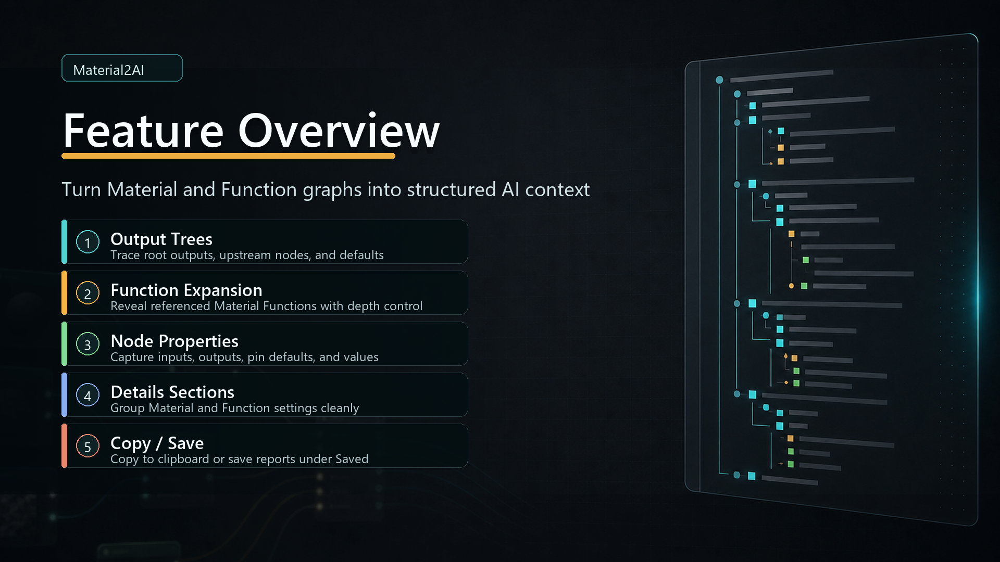

## Supported Unreal Engine Version

Tested with:

- Unreal Engine 5.7.4, 5.6.1
- Windows / Win64 editor workflow

Plugin type:

- Module type: Editor
- Supported platform: Win64
- Runtime replication: No
- Blueprint assets included: No

## What Material2AI Exports

Material2AI exports graph structure first, with optional details when deeper
inspection is needed.

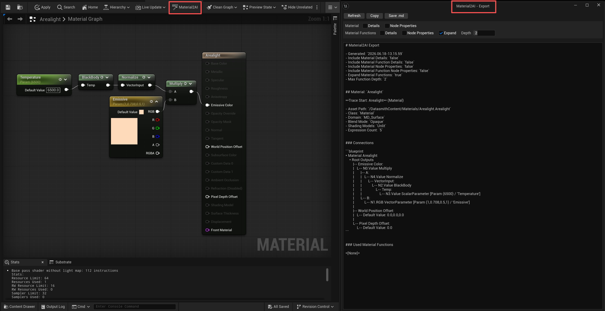

It can include:

- Material root output trees
- Material Function output trees
- Connected node chains
- Default values for unconnected outputs and inputs
- Referenced Material Functions
- Optional Material Details
- Optional Material Function Details
- Optional Material Node Properties
- Optional Material Function Node Properties

## Installation

Install Material2AI from Fab, then enable it from Unreal Engine's Plugins
window.

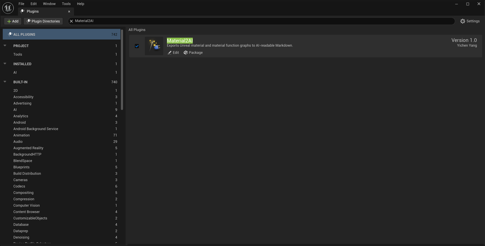

After enabling the plugin, restart the editor if Unreal asks for it.

## Basic Usage

Material2AI can be opened from the Content Browser or directly from the Material
Editor.

## Content Browser Export

Right-click a Material or Material Function asset, then choose
`Material2AI: Export`.

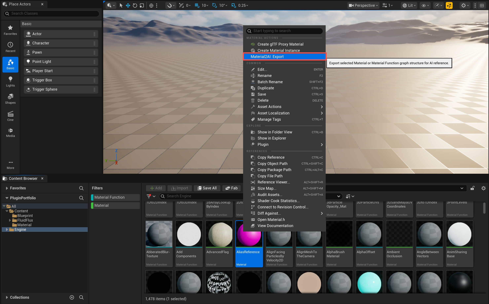

Supported assets include:

- Material
- Material Function
- Material Function Instance
- Material Function Material Layer
- Material Function Material Layer Blend

## Material Editor Export

Open a Material or Material Function, then click the `Material2AI` toolbar
button.

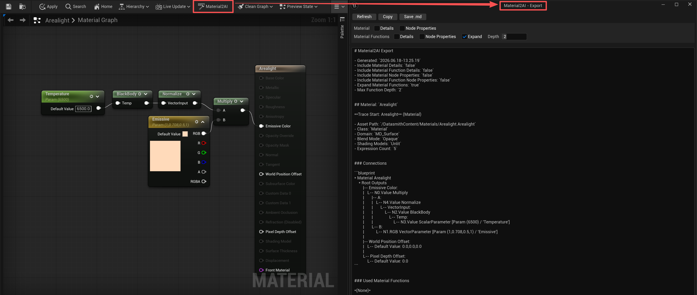

This is useful when you are already editing a graph and want to generate a
report without returning to the Content Browser.

## Export Window

The export window lets you preview, refresh, copy, save, and customize the
generated report.

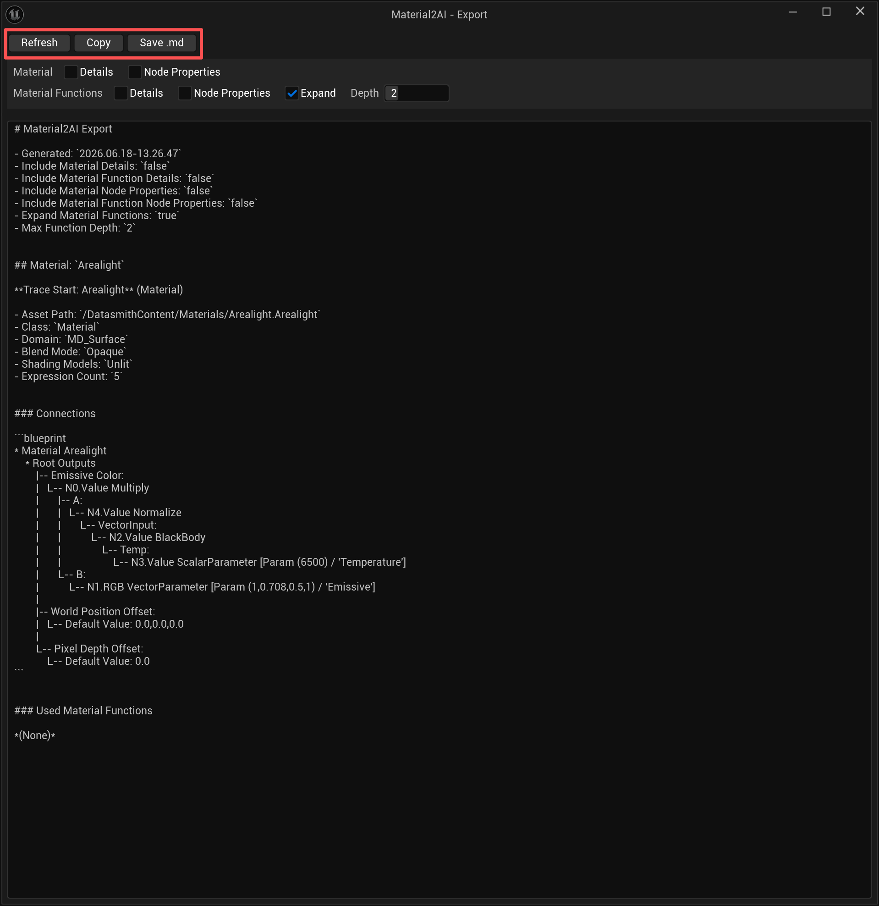

## Refresh

Use `Refresh` after changing the material or changing export options.

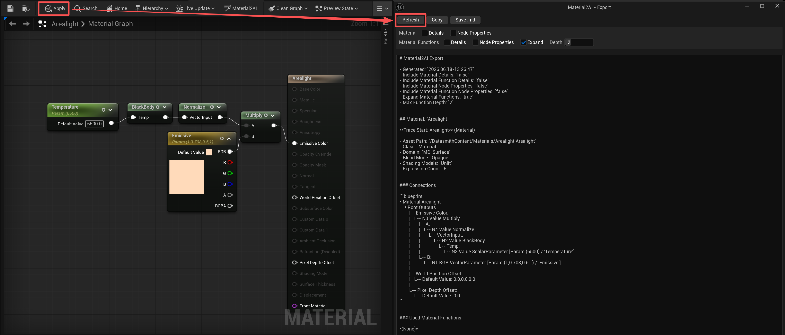

## Save .md

Use `Save .md` to save the visible report text under the project
`Saved/Material2AI` folder.

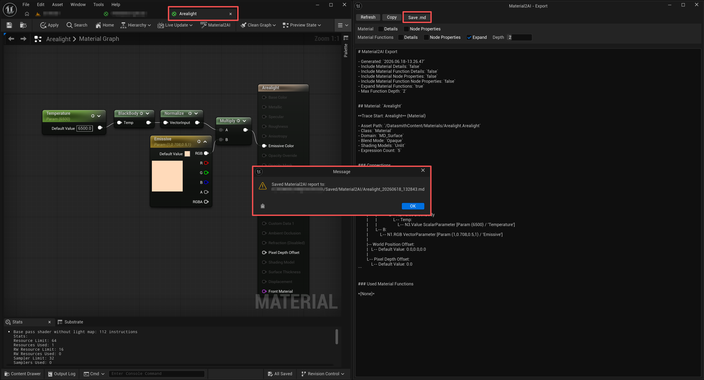

## Details

Enable `Details` when you want asset-level Material or Material Function
settings in the report.

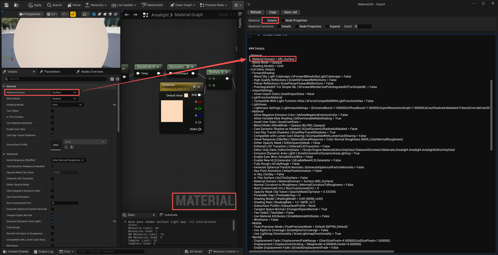
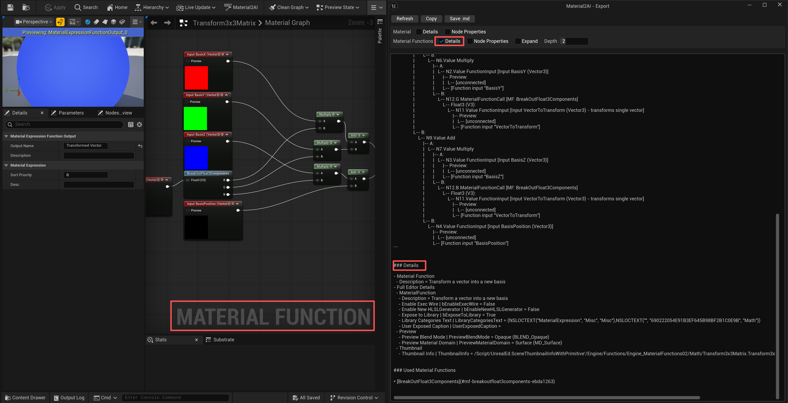

## Node Properties

Enable `Node Properties` when you need deeper node-level information, such as
editable expression properties.

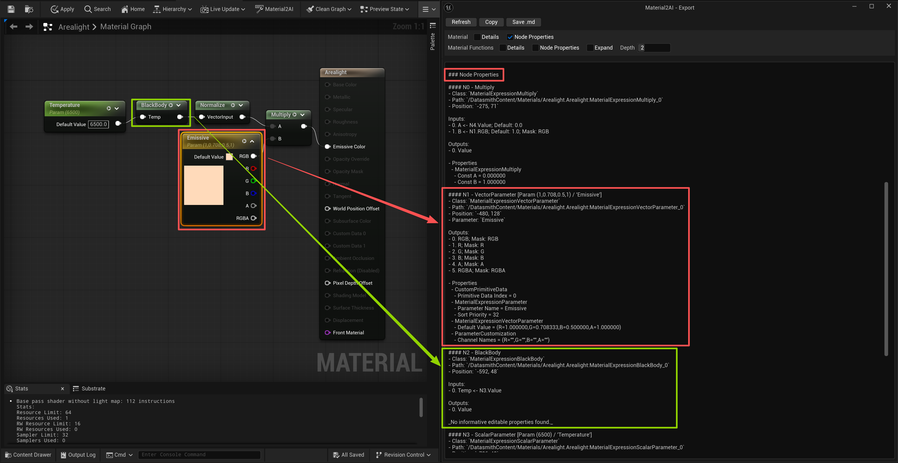

## Expand

Enable `Expand` to include referenced Material Function graphs in the same
report.

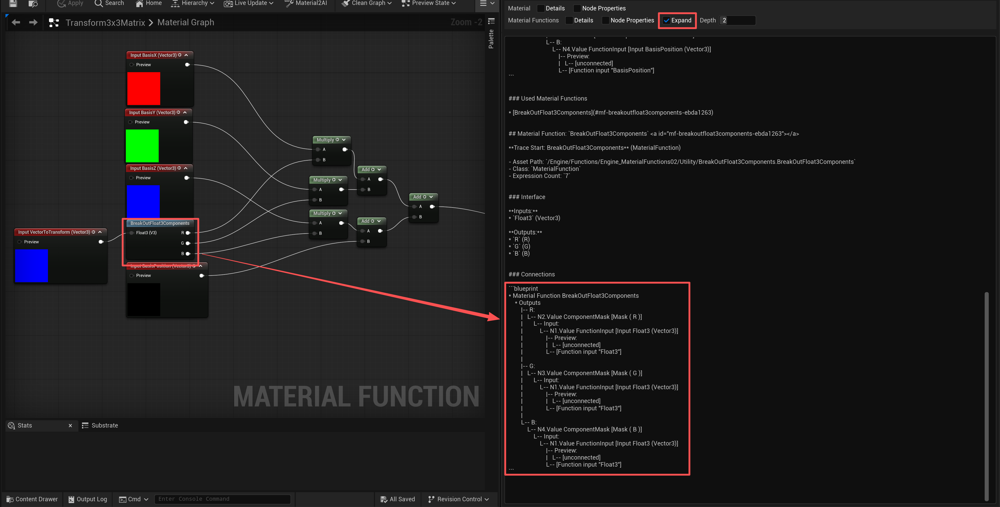

## Depth

Use `Depth` to control how many nested Material Function levels are expanded. (Notice: To use `Depth` you need to enable `Expand`)

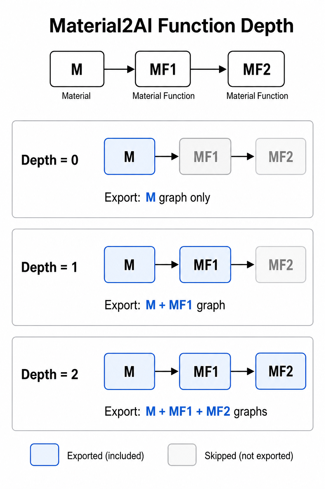

Depth behavior:

- `0`: Do not expand referenced functions.
- `1`: Expand directly referenced functions.
- `2`: Expand direct functions and one nested level.
- Maximum depth: 8

## Output Structure

Material2AI keeps each asset in its own section so the report stays readable.

```text
Material
  Graph Tree
  Details
  Node Properties
  Used Material Functions

Material Function
  Interface
  Graph Tree
  Details
  Node Properties
  Used Material Functions
```

Example tree:

```text
* Material M_Example
    * Root Outputs
        |-- Base Color:
        |   L-- N0.RGB Constant3Vector [0,0,0]
        |
        |-- Roughness:
        |   L-- N1.R Multiply
        |       |-- A:
        |       |   L-- N2.R ScalarParameter [Roughness]
        |       L-- B:
        |           L-- Default Value: 0.5
        |
        L-- Normal:
            L-- Default Value: 0.0,0.0,1.0
```

Connector meaning:

- `|--` means this branch has more sibling branches after it.
- `L--` means this is the last branch at that level.

## Packaging Notes

This section is mainly for developers or users testing source packaging.

When packaging the plugin with Unreal's `BuildPlugin` workflow, use an
ASCII-only output path.

Example package paths:

```text
C:/UEPluginPackages/Material2AI
F:/UEPluginPackages/Material2AI
```

Avoid package output paths containing non-ASCII characters because Unreal
Automation Tool / build tooling may produce garbled intermediate paths on some
Windows setups.

## Technical Details

Plugin module:

```text
Material2AI - Editor
```

Primary implementation areas:

- `FMaterial2AIModule`: Registers editor menus and opens the export window.
- `SMaterial2AIOutputWindow`: Slate UI for previewing, copying, and saving
  reports.
- `FMaterial2AIExporter`: Walks Material and Material Function graph data.
- `FMaterial2AIExportSettings`: Stores export options.

Important Unreal Engine systems used:

- ToolMenus
- Content Browser asset context menus
- Material Editor toolbar extension
- Slate UI
- UObject reflection
- Material expression graph APIs

## Limitations

- Material2AI is editor-only and is not intended for packaged game runtime use.
- Current release targets Win64 editor workflows.
- Very large graphs may be summarized or truncated to keep the editor
  responsive.
- Details and Node Properties can be verbose; leave them off for compact AI
  prompts.
- The exported report is a structural description, not a replacement for Unreal
  Engine's material compiler or shader output.

## Troubleshooting

### The plugin does not appear in the editor

Make sure Material2AI is installed and enabled in the Unreal Engine Plugins
window.


If you are using a source version, rebuild the project and restart the editor.

### Packaging fails with a missing SharedPCH source file

Use an ASCII-only package output path.

```text
C:/UEPluginPackages/Material2AI
```

This can happen if the package destination contains non-ASCII characters and
the build toolchain garbles the temporary HostProject path.

### The report is too long for an AI prompt

Disable detailed sections first:

- Material Details
- Material Function Details
- Material Node Properties
- Material Function Node Properties

You can also reduce the Material Function expansion depth.

### Some inputs show default values instead of nodes

This means the input was not connected to another expression, but Material2AI
found a usable editor default value for that input.

### A Material Function appears only as a reference

Enable `Material Functions > Expand`, then increase `Depth` if the function is
nested deeper than the current limit.

## FAQ

### Does Material2AI modify my materials?

No. Material2AI only reads editor graph data and generates a text report.

### Can I use it in a packaged game?

No. Material2AI is an editor plugin for Unreal Editor workflows.

### Does it require an AI service or API key?

No. Material2AI only generates structured text. You can use that text with the
AI tool of your choice.

### Does it support Material Functions?

Yes. It can export Material Function assets directly and expand referenced
Material Functions from a Material graph.

### Where are saved reports stored?

Saved reports are written under:

```text
<YourProject>/Saved/Material2AI/
```

## Support

For support, please include:

- Unreal Engine version
- Material2AI version
- Whether the issue happens from the Content Browser or Material Editor toolbar
- Selected asset type
- Relevant Unreal Output Log messages

Contact:

- GitHub Issues: `https://github.com/AIceDog/Material2AI/issues`
- Email: `15927443559@163.com`

